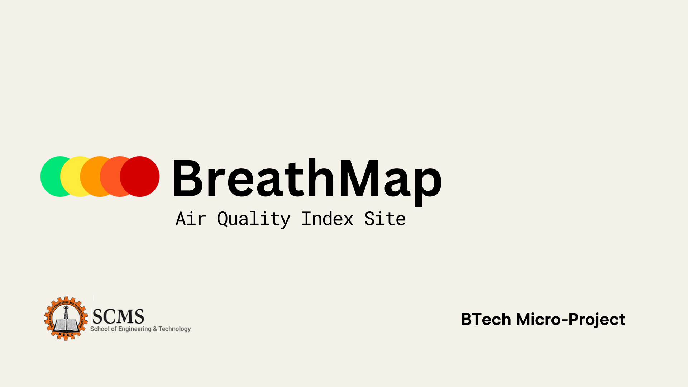

 # BreathMap - Real-time Air Quality Monitoring

  

## Overview

BreathMap is a web application that provides real-time air quality monitoring and visualization. The platform aggregates data from various environmental sensors to give users up-to-date information about air pollution levels in their area.
**This was made for a college project**
## Features

- 🌍 Real-time air quality index (AQI) visualization
- 📱 Responsive design for all devices
- 🗺️ Interactive map interface
- 🛎️ Notifications for AQI

## Technologies Used

- Frontend: React.js, Mapbox GL JS, Chart.js
- Backend: Node.js, Express
- Database: MongoDB
- Deployment: AWS EC2 / Netlify / Vercel
- Other: AirVisual API, OpenWeatherMap API

### Prerequisites

- Node.js (v14 or higher)
- npm or yarn
- MongoDB Atlas account or local MongoDB instance
- Mapbox API key
- AirVisual API key

## Contact

For questions or support, please contact us at:
- Email: breathmap@proton.me
- Website: [https://breathmap.site](https://breathmap.site)

## Acknowledgments
- Claude Sonnet 3.7 
- Thanks to all open-source projects that made this possible
- Special thanks to our data providers and contributors

---

